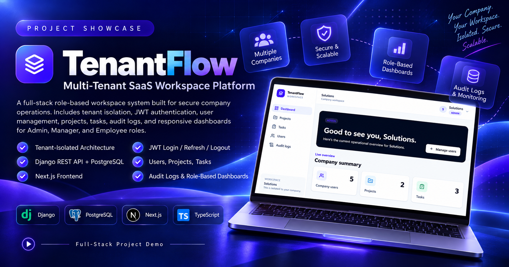

# TenantFlow

TenantFlow is a multi-tenant SaaS application with a Django REST Framework API and a Next.js frontend. Company data is isolated at the backend, with Admin, Manager, and Employee permissions reflected in the user interface.

## Local startup order

1. Start PostgreSQL and create the database and user documented in [`backend/README.md`](backend/README.md).
2. Set `BACKGROUND_JOBS_ENABLED=False` to run locally without Redis, or start Redis and set it to `True` when assignment-notification jobs are required.
3. From `backend/`, copy `.env.example` to `.env`, install `requirements.txt`, run `python manage.py migrate`, then run `python manage.py runserver`.
4. From `backend/`, start Celery with `celery -A config worker --loglevel=info` (`--pool=solo` may be required on Windows).
5. From `frontend/`, copy `.env.example` to `.env.local`, run `npm install`, then run `npm run dev`.

The frontend reads the API origin from `NEXT_PUBLIC_API_BASE_URL`; its example value is `http://127.0.0.1:8000`. Do not place secrets in either example environment file.

## Verification

Backend checks and PostgreSQL setup are documented in [`backend/README.md`](backend/README.md). Frontend setup and quality commands are documented in [`frontend/README.md`](frontend/README.md).
