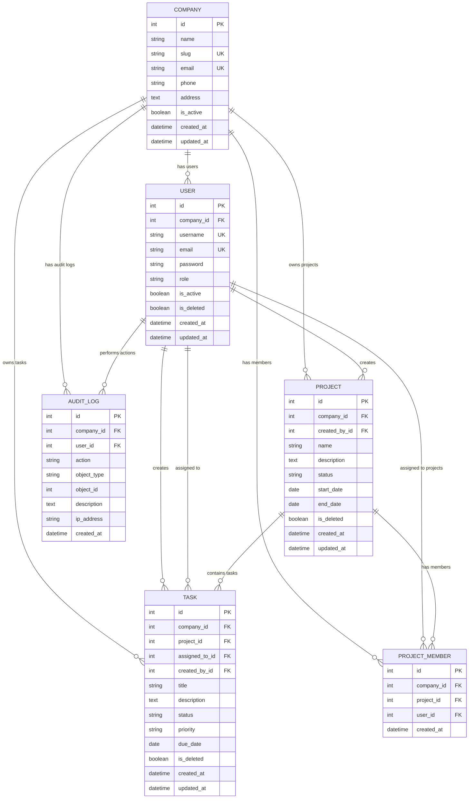

```mermaid
erDiagram

    COMPANY {
        int id PK
        string name
        string slug UK
        string email UK
        string phone
        text address
        boolean is_active
        datetime created_at
        datetime updated_at
    }

    USER {
        int id PK
        int company_id FK
        string username UK
        string email UK
        string password
        string role
        boolean is_active
        boolean is_deleted
        datetime created_at
        datetime updated_at
    }

    PROJECT {
        int id PK
        int company_id FK
        int created_by_id FK
        string name
        text description
        string status
        date start_date
        date end_date
        boolean is_deleted
        datetime created_at
        datetime updated_at
    }

    PROJECT_MEMBER {
        int id PK
        int company_id FK
        int project_id FK
        int user_id FK
        datetime created_at
    }

    TASK {
        int id PK
        int company_id FK
        int project_id FK
        int assigned_to_id FK
        int created_by_id FK
        string title
        text description
        string status
        string priority
        date due_date
        boolean is_deleted
        datetime created_at
        datetime updated_at
    }

    AUDIT_LOG {
        int id PK
        int company_id FK
        int user_id FK
        string action
        string object_type
        int object_id
        text description
        string ip_address
        datetime created_at
    }

    COMPANY ||--o{ USER : "has users"
    COMPANY ||--o{ PROJECT : "owns projects"
    COMPANY ||--o{ PROJECT_MEMBER : "has members"
    COMPANY ||--o{ TASK : "owns tasks"
    COMPANY ||--o{ AUDIT_LOG : "has audit logs"

    USER ||--o{ PROJECT : "creates"
    USER ||--o{ TASK : "creates"
    USER ||--o{ TASK : "assigned to"
    USER ||--o{ AUDIT_LOG : "performs actions"
    USER ||--o{ PROJECT_MEMBER : "assigned to projects"

    PROJECT ||--o{ TASK : "contains tasks"
    PROJECT ||--o{ PROJECT_MEMBER : "has members"
```
